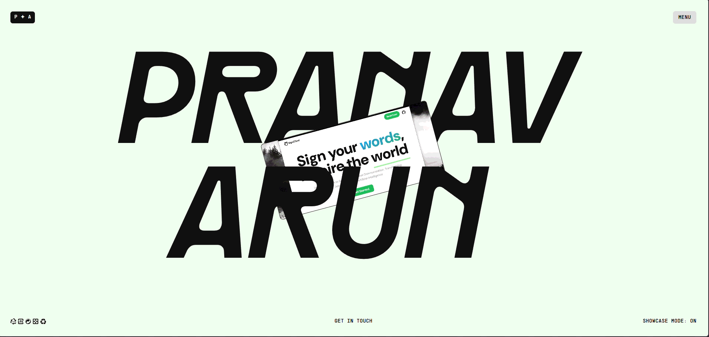

# Pranav Arun - Web Development Portfolio

Welcome to the documentation for Pranav Arun's Developer Portfolio. This project is a modern web development portfolio built to showcase a combination of high-quality design and robust technical implementation. It features seamless animations, responsive design, and an immersive user experience.

## Table of Contents
- [Project Overview](#project-overview)
- [Features](#features)
- [Technologies Used](#technologies-used)
- [Project Structure](#project-structure)
- [Installation and Setup](#installation-and-setup)
- [Design System](#design-system)
- [Responsive Design](#responsive-design)
- [Deployment](#deployment)
- [Contact](#contact)

## Project Overview
This portfolio is a carefully crafted digital experience demonstrating advanced web development techniques, including:
- Design principles focused on modern web aesthetics.
- Seamless page transitions utilizing GSAP.
- Interactive storytelling through scroll-triggered animations.
- Mobile-first responsive design adapted for multiple breakpoints.
- Performance optimization with a Vite-based build system.


*A quick preview of the interactive portfolio and its dynamic animations.*

## Live Demo
[View Live Portfolio](https://github.com/toxicbishop/Portfolio-5)

## Features

### Core Features
- Smooth Page Transitions: Navigation between pages with GSAP-powered animations.
- Scroll-Triggered Animations: Content reveals and interactions based on scroll position.
- Responsive Design: Optimized layouts for all devices.
- Interactive Navigation: Slide-in menu with smooth transitions.
- Project Showcase: Interactive portfolio gallery highlighting featured work.

### Technical Features
- Modern Build System: Vite-based development for rapid iteration.
- Optimized Assets: Efficient image handling and preloading.
- Code Structuring: Modular JavaScript and CSS architecture.

## Technologies Used

### Core Technologies
- HTML5: Semantic markup.
- CSS3: Advanced styling with custom properties, Flexbox, and CSS Grid.
- JavaScript (ES6+): Modular JavaScript for interactive components.
- Vite: Build tool and development server.

### Animation and Effects
- GSAP (GreenSock): Professional-grade animation library.
- ScrollTrigger: GSAP plugin for scroll-based animations.
- Lenis: Smooth scrolling library for enhanced user experience.

## Project Structure
```text
portfolio/
├── css/                 # CSS styling files
├── js/                  # JavaScript utilities and animations
├── public/              # Static assets (fonts, images)
├── contact.html         # Contact page HTML
├── index.html           # Main landing page HTML
├── package.json         # Project dependencies and scripts
├── vite.config.js       # Vite configuration
└── README.md            # Project documentation
```

## Installation and Setup

### Prerequisites
- Node.js
- pnpm package manager
- Git

### Local Development
1. Clone the repository:
   ```bash
   git clone https://github.com/toxicbishop/Portfolio-5.git
   ```
2. Install dependencies:
   ```bash
   pnpm install
   ```
3. Start the development server:
   ```bash
   pnpm dev
   ```
4. Build for production:
   ```bash
   pnpm build
   ```
5. Preview the production build:
   ```bash
   pnpm preview
   ```

## Design System

### Color Palette
The portfolio uses a CSS custom properties-based color system:
- Primary: #1a1a1a
- Secondary: #f5f5f5
- Accent: #ff6b6b
- Background: #ffffff

### Typography
- Rader: Used for primary headings.
- Formula Narrow: Used for body text and descriptions.
- Supply Mono: Used for technical UI elements and labels.

## Responsive Design
- Mobile Strategy (Under 1000px): Simplified animations, touch-friendly interactions, and stacked single-column layouts for improved readability and performance.
- Desktop Enhancements (Above 1000px): Complex animation suites, multi-column grid layouts, and advanced hover interactions.

## Deployment
The repository is set up for easy deployment on modern hosting platforms such as Vercel, Netlify, or GitHub Pages. Ensure the build command `pnpm build` is executed and the `dist/` output directory is served.

## Contact
**Pranav Arun**
- GitHub: [toxicbishop](https://github.com/toxicbishop)
- LinkedIn: [Pranav Arun](https://www.linkedin.com/in/pranav-arun)
- Instagram: [@toxicbishop_](https://www.instagram.com/toxicbishop_)
- Email: pranavarun19@gmail.com